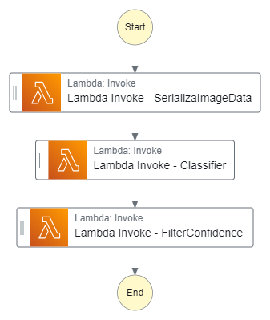
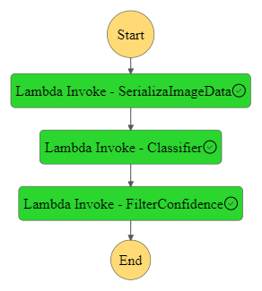

# ML WORKFLOW FOR SCONES UNLIMITED ON AWS Sagemaker

## A Production-Ready MLOps Pipeline for Image Classification on the CIFAR-100 Dataset

---

### Introduction

Scones Unlimited wants to reliably classify images to route its delivery services more effectively. This project demonstrates a Machine Learning workflow on AWS for image classification using a subset of the CIFAR-100 dataset (focusing on bicycles and motorcycles). The project covers:

- Data Preprocessing
- Model Training & Deployment on Amazon SageMaker
- Setting up Model Monitor for real-time data capture
- Building AWS Lambda functions for serverless inference orchestration
- Chaining everything with AWS Step Functions

### Key AWS Services:
- **`S3`**: Data storage (training images, .lst metadata, model artifacts)
- **`SageMaker`**: Training, deploying, and monitoring the model
- **`Lambda`**: Serverless inference and data transformations
- **`Step Functions`**: Orchestrating the Lambda functions and handling workflow logic

---

## Architecture Overview

A high-level diagram illustrating the workflow with key components like SageMaker, Lambda, and Step Functions.

---

## Project Workflow

### Data Extraction & Transformation
- Download CIFAR-100 dataset, filtering relevant classes (bicycle, motorcycle).
- Convert to the format required by the SageMaker Image Classification algorithm (.lst files).

### Model Training
- Use the SageMaker Image Classification built-in algorithm on an `ml.p3.2xlarge` instance.
- Validate training data for corrupted images before launching the job.

### Deployment & Monitoring
- Deploy the model to a SageMaker `Endpoint` with Data Capture enabled for real-time monitoring.
- Analyze captured data in S3 to review input and output distributions over time.

### AWS Lambda Functions
1. **SerializeImageData**: Reads an image from S3, base64-encodes it, and sends it to Step Functions.
2. **Classifier**: Invokes the SageMaker endpoint, processes the raw results (probabilities).
3. **FilterConfidence**: Evaluates if an inference is above a confidence threshold.

### Step Functions
- Chains the Lambda functions in sequence.
- fails loudly if inferences do not meet the confidence threshold.

---

## Features & Highlights
- **Scalability**: Data stored on `S3` is processed in parallel using Step Functions with fan-out states.
- **Monitoring**: SageMaker Model Monitor captures and analyzes live traffic.
- **Serverless Architecture**: `AWS Lambda` significantly reduces overhead for running code.
- **Event-Driven**: The entire pipeline can trigger on new data arrivals or scheduled intervals.

---

## Challenges Solved

1. **Data Format Requirements**:
   - Automating the conversion of local images to S3-based `.lst` metadata required by the SageMaker Image Classification algorithm.
2. **Corrupted Image Detection**:
   - Implements checks to prevent invalid data from affecting training.
3. **Confidence Thresholding**:
   - Ensures workflows reliability by rejecting low-confidence inferences.
4. **Parallel Execution**:
   - Using Step Functions to fan out Lambda tasks for multiple images simultaneously.
5. **Error Handling**: Step Functions integrated with Amazon `SNS` to notify on errors.

---

# Installation & Setup

## Clone the Repository

```bash
git clone https://github.com/EsraaKamel11/scones-unlimited-ml-workflow.git
cd scones-unlimited-ml-workflow
```

## Configure AWS CLI

1. Make sure you have the AWS CLI installed.
2. Configure your AWS credentials:

   ```bash
   aws configure
   ```

3. Ensure you have the necessary IAM permissions to create/modify S3, SageMaker, Lambda, and Step Functions resources.

## Set Up Notebook

1. Launch your SageMaker Notebook instance (`ml.t3.medium` or similar) with the Python 3 (Data Science) kernel.
2. Upload the `notebooks/` folder to your notebook instance.

---

# Usage Instructions

## 1. Data Extraction & Transformation, Model Training & Deployments
1. Open `notebooks/01_notebook.ipynb`.
2. Run all cells to extract CIFAR-100 data, filter relevant classes, and upload to S3.
3. Configure the training hyperparameters and run the training job on SageMaker.
4. Wait for training to complete, then deploy the model to an endpoint.

## 2. Lambda & Step Functions
1. Deploy Lambda functions:
   - Adjust environment variables (e.g., S3 bucket name, SageMaker endpoint name).
   - Zip and upload each Lambda function via the AWS Console or CLI.
2. Create/Update Step Functions state machine:
   - Update the ARNs of Lambda functions within the Step Functions definition (JSON).
   - Start execution to test the workflow with sample images.

## 3. Monitor & Logs
1. Check CloudWatch Logs for your Lambda functions.
2. Check the Step Functions console to visualize each state execution.
---

### Attaching Required Policies to Lambda Functions
To ensure that each Lambda function can access necessary AWS resources, follow these steps to attach the required IAM policies:

#### SerializeImageData Function:
1. In the Lambda console, under the **Configuration** tab → **Permissions**, note the IAM role’s ARN.
2. Go to the IAM console, find that role, and verify the policy includes:

```json
{
  "Version": "2012-10-17",
  "Statement": [
    {
      "Effect": "Allow",
      "Action": [
        "s3:GetObject",
        "s3:ListBucket"
      ],
      "Resource": [
        "arn:aws:s3:::YOUR_BUCKET_NAME",
        "arn:aws:s3:::YOUR_BUCKET_NAME/*"
      ]
    },
    {
      "Effect": "Allow",
      "Action": [
        "logs:CreateLogGroup",
        "logs:CreateLogStream",
        "logs:PutLogEvents"
      ],
      "Resource": [
        "arn:aws:logs:*:*:*"
      ]
    }
  ]
}
```

#### Classification Function:
1. In the Lambda console, under the **Configuration** tab → **Permissions**, note the IAM role’s ARN.
2. Go to the IAM console, find that role, and verify the policy includes:

```json
{
  "Version": "2012-10-17",
  "Statement": [
    {
      "Sid": "InvokeSagemakerEndpoint",
      "Effect": "Allow",
      "Action": "sagemaker:InvokeEndpoint",
      "Resource": "arn:aws:sagemaker:REGION:ACCOUNT_ID:endpoint/ENDPOINT_NAME"
    },
    {
      "Effect": "Allow",
      "Action": [
        "logs:CreateLogGroup",
        "logs:CreateLogStream",
        "logs:PutLogEvents"
      ],
      "Resource": [
        "arn:aws:logs:*:*:*"
      ]
    }
  ]
}
```

#### FilterInferences Function:
1. In the Lambda console, under the **Configuration** tab → **Permissions**, note the IAM role’s ARN.
2. Go to the IAM console, find that role, and verify the policy includes:

```json
{
  "Version": "2012-10-17",
  "Statement": [
    {
      "Effect": "Allow",
      "Action": [
        "s3:PutObject"
      ],
      "Resource": "arn:aws:s3:::YOUR_BUCKET_NAME/*"
    },
    {
      "Effect": "Allow",
      "Action": "sns:Publish",
      "Resource": "arn:aws:sns:REGION:ACCOUNT_ID:TOPIC_NAME"
    },
    {
      "Effect": "Allow",
      "Action": [
        "logs:GetLogEvents",
        "logs:DescribeLogGroups",
        "logs:DescribeLogStreams"
      ],
      "Resource": "arn:aws:logs:*:*:*"
    }
  ]
}
```

---

### Step Functions State Machine

Use the Step Functions Visual Editor to create three Lambda task states in series:

1. SerializeImageData
2. Classifier
3. FilterConfidence

Ensure that the input/output from each Lambda function is properly passed to the next state (e.g., `$.body`).

Export the state machine definition as JSON and keep a screenshot of it running.

State Machine Definition:

```json
{
  "Comment": "A description of my state machine",
  "StartAt": "Lambda Invoke - SerializaImageData",
  "States": {
    "Lambda Invoke - SerializaImageData": {
      "Type": "Task",
      "Resource": "arn:aws:states:::lambda:invoke",
      "Output": "",
      "Arguments": {
        "FunctionName": "arn:aws:lambda:REGION:ACCOUNT_ID:function:SerializeImageData:$LATEST",
        "Payload": ""
      },
      "Retry": [
        {
          "ErrorEquals": [
            "Lambda.ServiceException",
            "Lambda.AWSLambdaException",
            "Lambda.SdkClientException",
            "Lambda.TooManyRequestsException"
          ],
          "IntervalSeconds": 1,
          "MaxAttempts": 3,
          "BackoffRate": 2,
          "JitterStrategy": "FULL"
        }
      ],
      "Next": "Lambda Invoke - Classifier"
    },
    "Lambda Invoke - Classifier": {
      "Type": "Task",
      "Resource": "arn:aws:states:::lambda:invoke",
      "Output": "",
      "Arguments": {
        "FunctionName": "arn:aws:lambda:REGION:ACCOUNT_ID:function:Classifier:$LATEST",
        "Payload": ""
      },
      "Retry": [
        {
          "ErrorEquals": [
            "Lambda.ServiceException",
            "Lambda.AWSLambdaException",
            "Lambda.SdkClientException",
            "Lambda.TooManyRequestsException"
          ],
          "IntervalSeconds": 1,
          "MaxAttempts": 3,
          "BackoffRate": 2,
          "JitterStrategy": "FULL"
        }
      ],
      "Next": "Lambda Invoke - FilterConfidence"
    },
    "Lambda Invoke - FilterConfidence": {
      "Type": "Task",
      "Resource": "arn:aws:states:::lambda:invoke",
      "Output": "",
      "Arguments": {
        "FunctionName": "arn:aws:lambda:REGION:ACCOUNT_ID:function:FilterConfidence:$LATEST",
        "Payload": ""
      },
      "Retry": [
        {
          "ErrorEquals": [
            "Lambda.ServiceException",
            "Lambda.AWSLambdaException",
            "Lambda.SdkClientException",
            "Lambda.TooManyRequestsException"
          ],
          "IntervalSeconds": 1,
          "MaxAttempts": 3,
          "BackoffRate": 2,
          "JitterStrategy": "FULL"
        }
      ],
      "End": true
    }
  },
  "QueryLanguage": "JSONata"
}
```
- Parallel/Fan-Out
  - Modify the above to include a `Map` state for processing multiple images concurrently.
- Error Handling & Notifications
  - Add Catch blocks that trigger an SNS publish or a separate Lambda for error notifications.

----
## Step Functions Workflow

Below is a visual representation of the Step Functions workflow linking our three Lambda tasks:

<div align="center">
  
</div>

---

## Testing & Evaluation

- Generate random test inputs:

```python
import random
import boto3
import json

def generate_test_case(bucket):
    s3 = boto3.resource('s3')
    objects = s3.Bucket(bucket).objects.filter(Prefix="test/")
    obj_key_list = [obj.key for obj in objects if obj.key.endswith('.png')]
    chosen_key = random.choice(obj_key_list)

    return json.dumps({
        "image_data": "",
        "s3_bucket": bucket,
        "s3_key": chosen_key
    })
```

- Invoke the Step Function in the AWS console with this random JSON input.
  This random JSON input might look like this:
  
  ```json
  {
   "image_data": "",
   "s3_bucket": "sagemaker-us-east-1-517011496817",
   "s3_key": "test/cycle_s_001297.png"
  }
  ```

- Check the Step Function logs to confirm success or loud failure (if confidence < threshold).
  When the workflow completes without errors, you’ll see a green checkmark on each step:

<div align="center">
  
</div>

- Model Monitor: The data capture is stored in S3 as JSONLines. Install `jsonlines` and parse the results to view your confidence distribution over time.

```python
# Example of reading JSONLines from captured_data/
!pip install jsonlines
import jsonlines
import os
from sagemaker.s3 import S3Downloader

data_path = f"s3://{bucket}/data_capture/{endpoint}/AllTraffic/2024/12/22/10/"
S3Downloader.download(data_path, "captured_data")

file_handles = os.listdir("captured_data")
json_data = []
for fh in file_handles:
    with jsonlines.open(f"captured_data/{fh}") as f:
        json_data.append(f.read())

def simple_getter(obj):
    inferences = obj["captureData"]["endpointOutput"]["data"]
    timestamp = obj["eventMetadata"]["inferenceTime"]
    return json.loads(inferences), timestamp
```
Visualize confidence scores vs. time to ensure the model is performing as expected!

---

## Project Structure
```plaintext
scones-unlimited-ml-workflow/
├── notebooks/
│   ├── 01_notebook.ipynb    
│ 
├── lambda/
│   ├── serialize_lambda.py
│   ├── classify_lambda.py
│   └── filter_lambda.py
├── stepfunctions/
│   └── state_machine_definition.json
├── images/
│   └── successful_execution.png
|   ├── step_function_graph.png
|   ├── step_function_graph.png
|   ├── 01_Screenshot.png
|   └── 02_Screenshot.png          
|    
├── requirements.txt
├── README.md
└── LICENSE
```

---

## Results & Outcomes
- **Accuracy**: Achieved 84.4% accuracy on the test set.
- **Confidence Threshold**: Step Functions reject inferences below ~90%.
- **Model Latency**: The SageMaker endpoint responds in under 200.4 ms on average.
- **Production Deployment**: The entire pipeline can be triggered automatically on new data arrivals or on a 
  schedule.
- **Monitoring**: Real-time traffic logs captured by Model Monitor.
- **Scalability**: Adding more image classes or more concurrent Lambda invocations is straightforward.

---

## Future Improvements
- **Multi-Class Expansion**: Extend the workflow to incorporate more classes:.
- **High-Throughput Batch**: Use SageMaker Batch Transform for large-scale offline predictions.
- **Parallel Fan-Out**: Modify Step Functions to parallelize images using a Map state.
- **Dummy Data Generator**: Utilize the test data generator to simulate continuous or bulk data input streams.
- **Failure Notifications**: Integrate Amazon SNS or other alerting services to notify whenever the Step Function 
   encounters errors.
- **Advanced Monitoring**: Configure scheduled Model Quality or Data Quality monitoring jobs.
- **Pipeline as Code**: Manage infrastructure with AWS CDK or CloudFormation for one-click deploys and consistent 
   environments.
- **Automated Retraining**: Integrate an MLOps pipeline to retrain the model upon drift detection

---
### Acknowledgments:
- CIFAR-100 Dataset
- AWS SageMaker Built-in Algorithms
- AWS Step Functions Visual Editor
